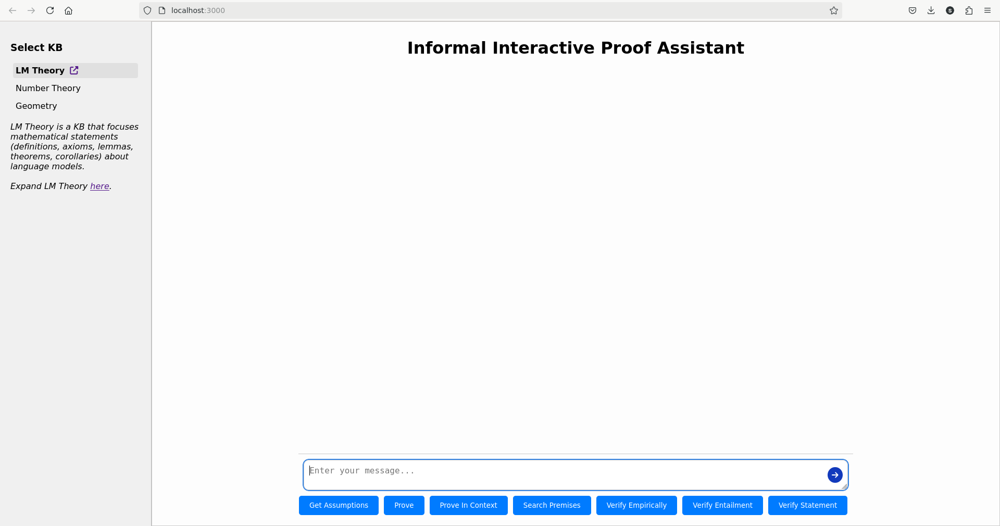

# IIPA -- Interactive Informal Proof Assistant

## Overview

IIPA is an assistant designed to interactively support informal proofs. Its user interface is structured to facilitate seamless communication and efficient knowledge retrieval. The image below shows the home page of the user interface.



Some key features shown at the image above are:

- **Knowledgebase Activation**: The left bar displays the currently activated knowledgebase and provides a link to its content.
  - From here, users can click the link to view the knowledgebase content directly.
  - There is also a link provided for adding new content to the knowledgebase.
- **Interactive Chat**: Users can interact with IIPA via a chat box located at the bottom of the main page.
- **Pre-defined Instruction Prompts**: Below the chat box, buttons allow users to insert pre-defined instruction templates, which are designed to activate specific tactics. Tactics can also be triggered dynamically by the assistant's `TacticChooser` mechanism based on user input, so one does not have to use the buttons.

## Docker Setup

Follow these steps to set up and run the IIPA project using Docker:

1. **Clone the repository and set up the project**:
   ```bash
   git clone git@github.com:SL2000s/iipa.git
   cd iipa
   source scripts/install.sh
   ```

2. **Configure the environment variables**:
   - Open the file `iipa/iipa_backend/.env` in your preferred editor.
   - Fill in the placeholder values with the required environment variable details.

3. **Start the project**:
   - From the root `iipa` directory (not within the `backend` or `frontend` directories), run:
     ```bash
     source scripts/start.sh
     ```
   - This process may take some time. Wait until you see the confirmation that `iipa_backend` has started.

4. **Access the application**:
   - Open your browser and navigate to: [http://localhost:3000](http://localhost:3000)
